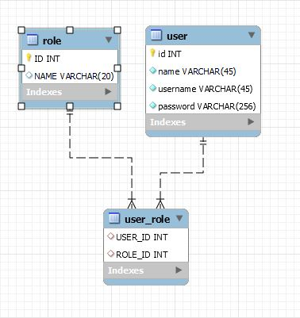

Welcome!

Requirements

- [Click here ](src/main/others/LoginApplication.pdf) to view requirement.

Database

Technologies

- MySql
- Spring Security
- React JS

Authentication

- Using Spring Security with role-based authentication

To run on your localhost:

- Ensure you have install Docker on your machine

Run the following scripts:

    docker run --detach --env MYSQL_ROOT_PASSWORD=root --env MYSQL_DATABASE=login_app --env MYSQL_PASSWORD=root --env MYSQL_USER=admin --name localhost --publish 3306:3306 mysql:8.0.26

    docker run -p 8000:8000 --name login-app-backend --link localhost:mysql norulshahlam/login-app-backend:0.0.1-SNAPSHOT

    docker run -it -p 3000:3000 --name login-app-frontend norulshahlam/login-app-frontend:latest

Once all 3 containers are up, run the following url on your browser:

    localhost:3000/login

If you have issue on CORS, run this script to open a chrome browser with CORS disabled:

    chrome.exe --user-data-dir="C://Chrome dev session" --disable-web-security

enter credentials:

manager role

    username: useruser
    password: useruser

user role

    username: managers
    password: managers

Currently there are only these pages:

- /login
  - for everyone
- /welcome
  - must be logged-in
- /restricted
  - only for managers
- /unauthorized
  - if logged user with no MANAGER role try to access, it will redirect here

[Click here for Front end repo](https://github.com/norulshahlam/login-app-frontend)  
[Click here for Back end repo](https://github.com/norulshahlam/login-app-backend)

